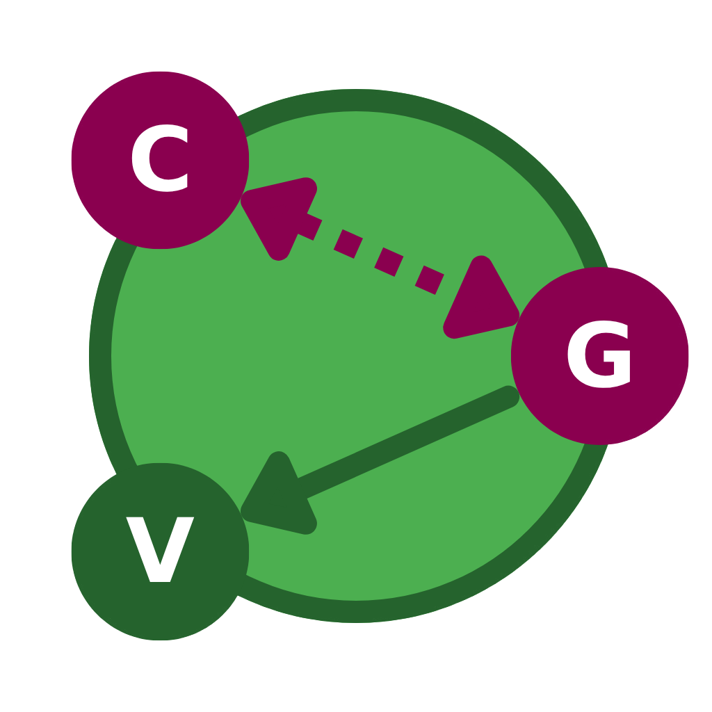

# Causal Graph Visualizer

An interactive tool for visualizing and editing causal graphs — available as both a **web application** and a **desktop application**.



---

## Try it Online

**[Launch Web App](https://causal-graph-visualizer-014f12.pages.imims.de/)**

---

## Download Desktop App

Download the latest version for your operating system from the [Releases](../../releases) page:

| Platform | File |
|----------|------|
| Windows | `.exe` installer |
| macOS | `.dmg` package |
| Linux | `.AppImage` |

---

## Features

- **Create & edit graphs** interactively, add nodes and directed edges with a few clicks or shortcuts
- **Import** CSV adjacency matrices (PAGs, ADMGs, and subsets) and JSON graph files (with full visualization metadata)
- **Export** as PDF, PNG (with DPI and transparency options), CSV matrix, or JSON graph
- **Edit node & edge properties**: colors, stroke widths, label fonts, arrowhead types, edge curvature, and more
- **Undo / Redo** functionality
- **Grid & snapping**: toggle an alignment grid and snap nodes/edges to it
- **Fit to Screen**: auto-centers and scales the graph to fill the canvas
- **Select All Nodes / Links**: quickly select everything for batch edits
- **Keyboard shortcuts** for efficient workflow (see table below)
- **Works offline** (desktop version)

---

## Graph Types Supported

The tool supports three types of causal graphs out of the box:

<!-- Example image placeholders -->
<!--  -->
<!--  -->
<!--  -->

| Type | Description |
|------|-------------|
| **DAG** | Directed Acyclic Graph, standard causal model |
| **ADMG** | Acyclic Directed Mixed Graph, includes bidirected edges for latent confounders |
| **PAG** | Partial Ancestral Graph, represents equivalence classes with circle endpoints |

---

## Quick Start

### Web App
1. Open the [web application](https://causal-graph-visualizer-014f12.pages.imims.de/)
2. Left-click the canvas and press **`Ctrl+Alt+N`** to add your first node
3. Hold **`Ctrl+Alt`** and click two nodes to connect them with a directed edge
4. Or import an existing file, see [File Formats](#file-formats) below

### Desktop App
1. Download the installer for your OS from [Releases](../../releases)
2. Install and launch, the app works fully offline
3. Same workflow as the web version

---

## Keyboard Shortcuts & Toolbar Buttons

| Action | Button | Shortcut |
|--------|:------:|----------|
| Import CSV Matrix | ✓ | – |
| Import JSON Graph | ✓ | – |
| Undo | ✓ | `Ctrl+Z` |
| Redo | ✓ | `Ctrl+Y` |
| Add Node | ✓ | `Ctrl+Alt+N` — opens a popup to enter the node name |
| Add Edge | – | `Ctrl+Alt+Click` on two nodes in sequence |
| Select All Nodes | ✓ | `Ctrl+A` |
| Select All Edges | ✓ | `Ctrl+Shift+A` |
| Multi-select Nodes | – | `Ctrl+Click` or `Ctrl+Drag` on canvas |
| Multi-select Edges | – | `Ctrl+Click` or `Ctrl+Shift+Drag` on canvas |
| Delete Selection | ✓ | `Delete` |
| Toggle Grid & Snapping | ✓ | `Alt+G` |
| Fit to Screen | ✓ | `Ctrl+Shift+F` |
| Export CSV Matrix | ✓ | – |
| Export JSON Graph | ✓ | – |
| Export PDF | ✓ | – |
| Export PNG | ✓ | — popup with DPI & transparency options |

---

## File Formats

### JSON Graph (`.json`)

Stores the full graph including all visual properties (positions, colors, fonts, curvature).
Recommended for saving and reopening work.

<!-- Sample file placeholder: add once examples/ folder is set up -->
<!-- [Download example JSON](assets/examples/example-graph.json) -->

### CSV Matrix (`.csv`)

Encodes the graph as an adjacency matrix. Useful for interoperability with causal discovery tools.

**Edge encoding:**

| Value | Meaning |
|-------|---------|
| `0` | No edge |
| `1` | Circle endpoint (`o`) |
| `2` | Arrowhead (`>`) |
| `3` | Tail (`—`) |
| `4–5` | ADMG bidirected combinations |

<!-- Sample file placeholder: add once examples/ folder is set up -->
<!-- [Download example CSV matrix](assets/examples/example-matrix.csv) -->

---

## Development

### Prerequisites

- [Node.js 18+](https://nodejs.org/)
- npm

### Setup

```bash
git clone https://github.com/erikwhisper/causal-graph-visualizer.git
cd causal-graph-visualizer
npm install
```

### Commands

```bash
npm run dev           # Web development server (Vite)
npm run electron      # Electron desktop app
npm run build         # Build web version
npm run dist          # Build desktop installers
```

---

## Roadmap

- [ ] Pan & Zoom (camera abstraction with `d3.zoom()`)
- [ ] Copy / Paste and Duplicate nodes
